# CS551 Fitness App 🏋️

**A personal-trainer companion app for managing clients, health profiles, and workout schedules — built natively for Android with Kotlin & Jetpack Compose.**


<p align="center">
  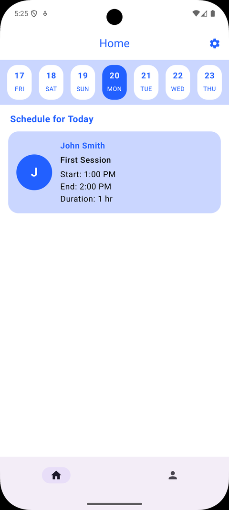
  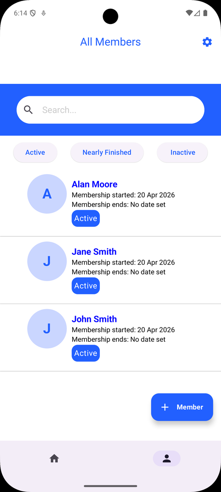
  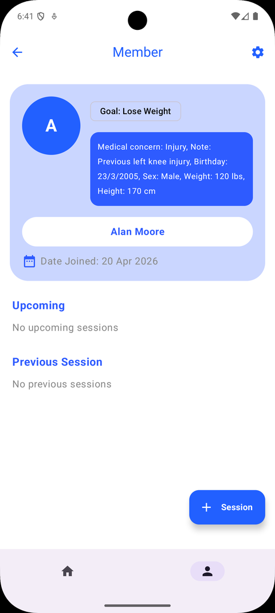
  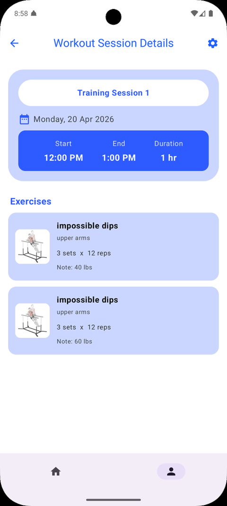
</p>

---

## Table of Contents

- [Client Brief](#client-brief)
- [Overview](#overview)
- [Features](#features)
- [App Walkthrough](#app-walkthrough)
- [Tech Stack](#tech-stack)
- [Getting Started](#getting-started)
- [Project Team](#project-team)
- [Known Limitations & Future Work](#known-limitations--future-work)
- [Acknowledgements](#acknowledgements)

---

## Client Brief

> This app was designed and built as an MSc group project (CS551), taking a real-world style client brief from concept through to a working Android prototype.

| | |
|---|---|
| **Client** | Sarah Thompson |
| **Age** | 30 |
| **Occupation** | Fitness Trainer |
| **Mobile Experience** | Expert |
| **The Ask** | A mobile app to support her clients' fitness routines and schedules — storing workout histories, allowing customisation based on fitness level, and connecting to open fitness APIs. |

## Overview

The app helps a personal trainer run their client roster from their phone. It lets the trainer:

- Register clients as members and capture their health & fitness profile
- Build a workout plan tailored to each member's goals and medical history
- Schedule workout sessions using exercises pulled live from a fitness API
- Keep a running history and schedule of every session, per client

## Features

- 📅 **Home dashboard** — today's sessions at a glance, with a 7-day scroller (3 days back, 3 days ahead)
- 👥 **Client roster** — searchable, filterable by *Active*, *Nearly Finished*, or *Inactive*
- 📝 **Guided member intake** — a step-by-step flow for gender, birthday, height/weight, fitness goal, and medical conditions
- 🧑‍⚕️ **Health-aware profiles** — medical concerns and free-text notes are captured up front so sessions can be planned safely
- 💪 **API-backed exercise library** — search and add exercises from an external fitness API, with sets, reps, duration, and notes per exercise
- ⚠️ **Graceful error handling** — a clear in-app message when the exercise API is unreachable, instead of a silent failure
- 🗓️ **Double-booking protection** — a "sessions today" check before a new session is scheduled
- 🔔 **Notifications** — a reminder before an upcoming client session, and a weekly summary of hours trained
- 🌗 **Full dark mode** — every screen supports light and dark themes
- 📱💻 **Phone & tablet support** — responsive layouts across form factors

## App Walkthrough

### Home & Client Roster

The trainer lands on **Home**, showing the day's schedule with quick access to nearby days. **All Members** lists every registered client with status filters and a search bar.

<p align="center">
  
  
</p>

### Registering a New Client

Tapping **+ Member** launches a guided, one-question-per-screen intake flow: gender → birthday → height → weight → goal → medical conditions → name & number of sessions. Capturing this up front lets the trainer build a workout plan tailored to each client.

<p align="center">
  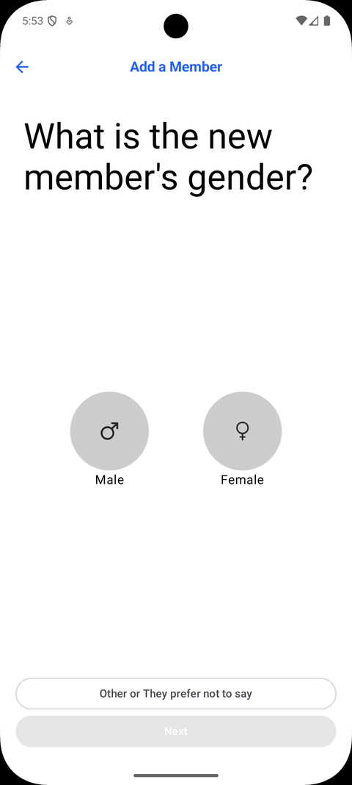
  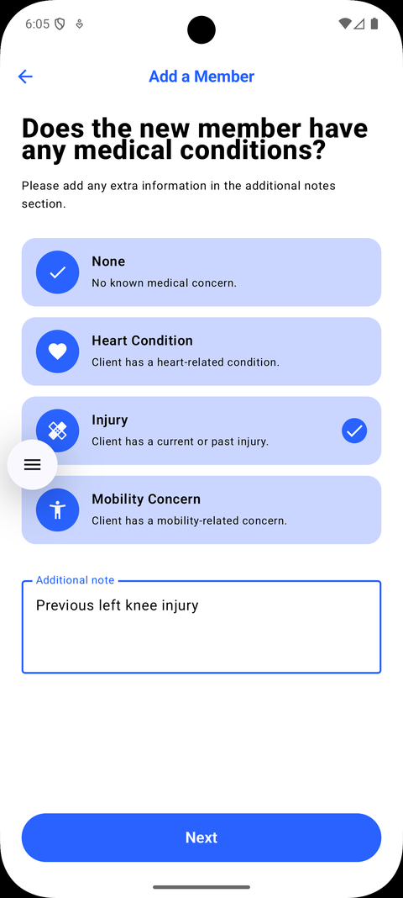
</p>

### Client Profile

Tapping a member opens their **profile** — goal, medical notes, key stats, and their upcoming and previous sessions in one place.

<p align="center">
  
</p>

### Building a Workout Plan

From a client's profile, **+ Session** opens the workout builder: name the session, pick a date and time (with a built-in check for existing sessions that day), then search a live exercise API to build out the workout list, setting sets, reps, duration, and notes for each exercise.

<p align="center">
  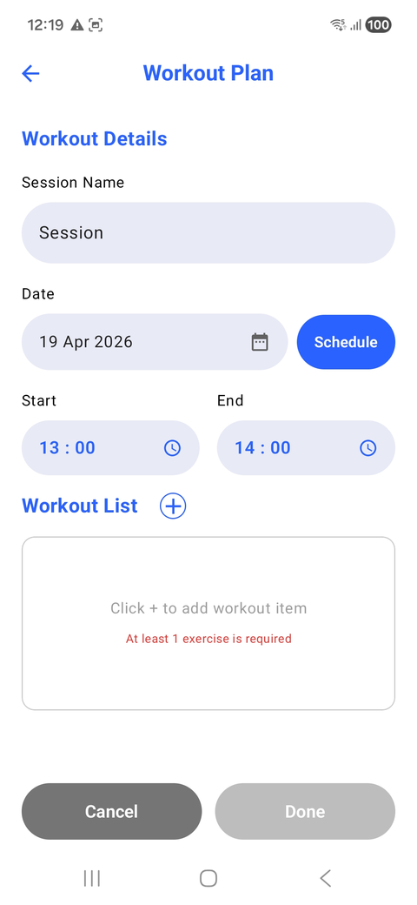
  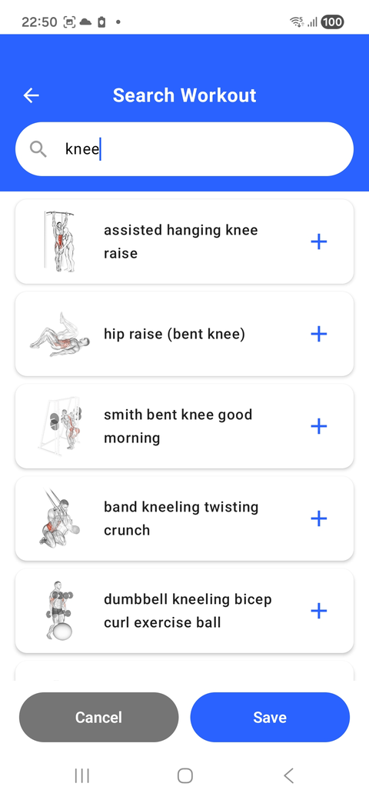
  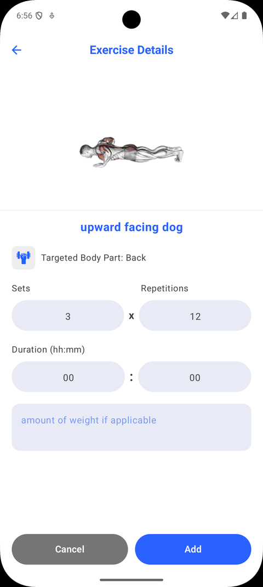
  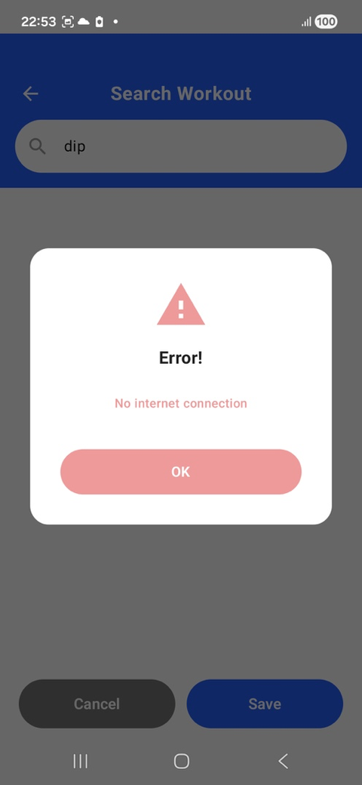
</p>

*If the exercise API can't be reached, the app surfaces a clear error instead of failing silently.*

### Session Details

Once saved, sessions appear on the client's profile and open into a full **Workout Session Details** view.

<p align="center">
  
</p>

### Preferences & Notifications

The settings screen (gear icon) lets the trainer toggle **weekly summary** and **upcoming session** notifications, and switch between light and dark themes — applied consistently across the whole app.

<p align="center">
  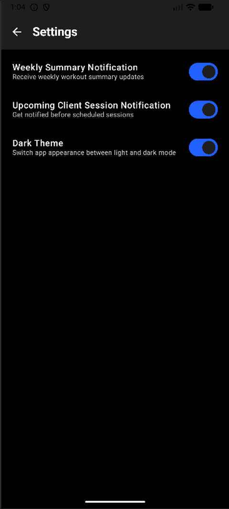
</p>

## Tech Stack

- **Language:** Kotlin
- **UI:** Jetpack Compose, built with custom composables and modifiers (e.g. `Modifier.drawBehind` for the member list dividers)
- **Data:** Exercise content sourced live from a third-party fitness API, with member/session data managed in-app
- **Notifications:** Native Android notifications for session reminders and weekly summaries
- **Design:** Full light/dark theming, responsive phone and tablet layouts

## Getting Started

```bash
# Clone the repo
git clone https://github.com/tobyweir/CS551FitnessApp.git

# Open in Android Studio, let Gradle sync, then run
# on an emulator or physical device (phone or tablet)
```

## Project Team

CS551 MSc Team 1:

- Abdulhafith Ahmed
- Robyn Shaw
- Darshan Venkatesh Murthy
- Pichawee Arreerob
- Toby Weir

## Known Limitations & Future Work

- **Profile pictures:** the add-member flow was designed to support uploading a profile picture, but there wasn't time to complete and test the feature — members currently display an initials avatar instead.

## Acknowledgements

- Icons via [Flaticon](https://www.flaticon.com/), including works by Freepik, Iconjam, Smashicons, and Smashingstocks (see in-app/report credits for individual links)
- The bottom-border styling on the All Members list adapts a [Stack Overflow](https://stackoverflow.com/questions/68592618/how-to-add-border-on-bottom-onlyin-jetpack-compose) approach for `drawBehind` in Jetpack Compose
